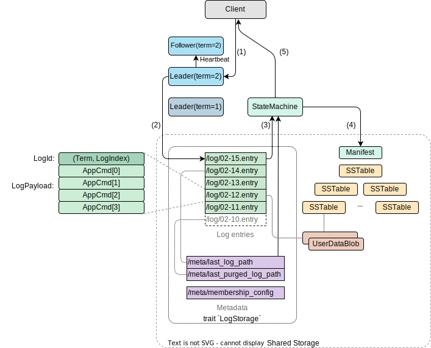

# Architecture Design

## System Requirement

- **Atomic Write**: The suRaft design assumes that the shared storage system supports **atomic write** operations that provide mutual exclusion. This is crucial for ensuring that only one leader can commit a log entry at a given index, which is essential for maintaining consistency in the cluster.

## Components

suRaft consists of two main components: a shared storage system and a set of coordinating nodes:

- **Storage Layer**: A reliable, strongly-consistent datastore (like Amazon S3) that maintains all consensus state and logs, acting as the single source of truth.

- **Compute Layer**: A stateless API layer where applications submit write requests to, with multiple nodes coordinating the leadership and consensus without requiring local disk storage.

## Key Differences from Raft

### Elimination of Log Replication

- **Single Series of Log Entries**: There is only one series of log entries and it is stored centrally in shared storage (e.g., Amazon S3). Thus:
	- There is no Log Replication Between Nodes,
	- There is no **truncation** operation caused by conflicting log entry series between nodes.
- **Atomic Operations for Consensus**: Nodes utilize storage-level atomic operations to achieve consensus, ensuring consistency without peer-to-peer communication.

### Omission of the State Machine

In **suRaft**, the state machine is not included in the core consensus  because it is considered part of the application's business logic. In **suRaft**, state machine is an external component.

### Leader Election

Leader election process mirrors that of Raft, with one key difference: **Terms** and **Votes** are not persisted to disk.

### Protocol to Commit a Log

In **suRaft**, log commitment is simplified through direct writes to shared storage. The leader bypasses node-to-node negotiation and writes log entries directly to the centralized storage. A log entry is considered committed immediately upon successful write, provided there are no write conflicts.

### Node State

Nodes are completely stateless. They do not maintain any persistent state locally; all necessary information is retrieved from shared storage.

### Membership Changes

Adding or removing nodes is straightforward and does not require a joint consensus or two-step update process. With all log entries stored in centralized storage, split-brain scenarios are inherently impossible.
