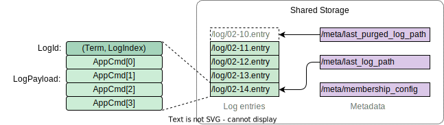

# Data Storage Structure



## Core Data Types

- **`Term`**: As in standard Raft, a monotonically increasing `u64` used to
  distinguish different leader terms.

- **`NodeId`**: A `String` that uniquely identifies a node. A node is a
  stateless process capable of participating in elections as a candidate or
  voter.

- **`VotedFor`**: An `Option<NodeId>` indicating the node (if any) that a given
  node has voted for in a specific `Term`. `VotedFor` is stored only in memory
  and is **not** persisted to storage.

- **`LogIndex`**: A `u64` representing the index of each log entry. It is
  encoded into a storage key using the following format:

  ```
  /log/<two_digits_of_total_length>-<index_value>.entry
  ```

  For example:
    - `LogIndex = 1` is encoded as `/log/01-1.entry`
    - `LogIndex = 123` is encoded as `/log/03-123.entry`
    - `LogIndex = 12,345` is encoded as `/log/05-12345.entry`
    - `LogIndex = 18,446,744,073,709,551,615` (maximum `u64` value) is encoded
      as `/log/20-18446744073709551615.entry`

  This variable-length encoding preserves the ordering of `LogIndex` values and
  provides a clean key space for small indices without extensive leading zeros.
  It is designed to support log indices up to 99 digits long. However, since
  `LogIndex` is a `u64`, the maximum value it can hold is `2^64 - 1`, which is a
  20-digit number (`LogIndex ≈ 1.84 × 10^19`), sufficient for most real-world
  applications.

- **`LogId`**: Similar to standard Raft, a tuple `(Term, LogIndex)`.

- **`LogPayload`**: A collection of application-defined commands to execute when
  a log entry is applied to the state machine: `LogPayload = Vec<AppCmd>`. The
  generic type parameter `AppCmd` represents the application's command type.

- `LogEntry`: combines a `LogId` with a `LogPayload`:

  ```rust
  struct LogEntry {
      log_id: LogId,
      payload: LogPayload,
  }

  type LogPayload = Vec<AppCmd>;
  ```

## Storage Data Layout

### Log Entries Storage

In storage, a `LogEntry` is serialized into bytes and stored in the
`/log/<encoded_log_index>.entry` key space. Examples of stored log entries
include:

```
/log/03-123.entry
/log/03-124.entry
/log/03-125.entry
...
```

Each file under `/log/` corresponds to a `LogEntry` with its `LogIndex` and
maintains the ordering necessary for consensus operations.

### Metadata Storage

Metadata provides essential supporting information that enhances the performance
and correctness of the system. The following metadata items are stored under the
`/meta/` namespace:

#### **Last Log Index** (`/meta/last_log_path`)

This key stores the path to the last serialized `LogIndex` in the storage. For
example, the value might be `/log/03-123.entry`. This metadata allows a node to
quickly locate the last log entry in the storage during recovery. Since it is
only used to approximate the position of the last log entry, it does not need to
be constantly updated and can be maintained lazily.

#### **Last Purged Log Index** (`/meta/last_purged_log_path`)

This key stores the serialized last purged `LogIndex`. Log entries with indices
equal to or less than this value have been purged from the storage and should no
longer be accessed. It is important to update this metadata **before** purging
the corresponding log entries to prevent other nodes from attempting to access
non-existent entries.

#### **Membership Configuration** (`/meta/membership_config`)

This key defines the current membership configuration of the cluster, specifying
which nodes are part of the cluster and their roles in the consensus process.
The membership configuration is critical for coordinating leader elections and
maintaining cluster consistency. It is represented as:

```rust
struct MembershipConfig {
    electables: BTreeSet<NodeId>,
    voters: BTreeSet<NodeId>,
    nodes: BTreeMap<NodeId, NodeInfo>,
}
```

- `electables`: A set of `NodeId`s representing nodes that are eligible to
  become candidates and initiate leader elections.

- `voters`: A set of `NodeId`s representing nodes that are permitted to vote in
  elections.

- `nodes`: A mapping from each `NodeId` to its corresponding `NodeInfo`. The
  `NodeInfo` struct contains metadata about each node, such as network addresses
  and other relevant attributes.

